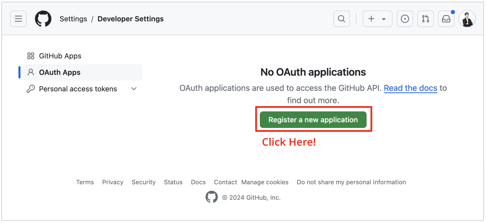
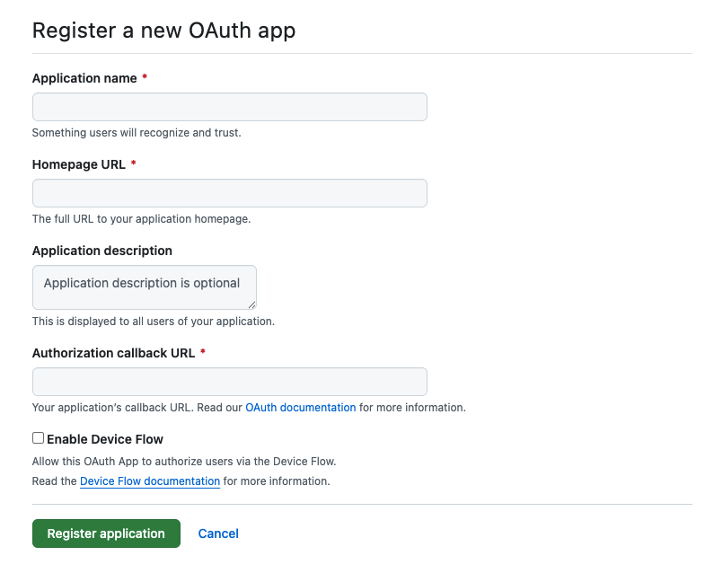
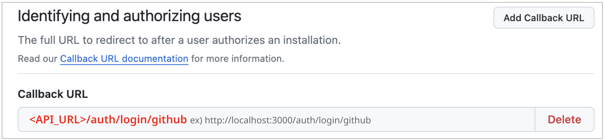

# Set Up GitHub OAuth

For the Social Login feature, you need to obtain a GitHub OAuth key before running the project. After completing this step, you should have the `GITHUB_CLIENT_ID` and `GITHUB_CLIENT_SECRET` values.

## 1. Visit GitHub and Sign In

Visit [GitHub](https://github.com/) and sign in to your account.
You should have a GitHub account to create an OAuth application.

## 2. Visit Developer Settings

You can access the Developer Setting by [this link](https://github.com/settings/apps).

Or, you can access the Developer Settings page by clicking on your profile icon in the top right corner of the page and selecting `Settings`. Then, click on the `Developer settings` tab.

## 3. Create a New OAuth App

To obtain the `GITHUB_CLIENT_ID` and `GITHUB_CLIENT_SECRET`, you need to create a OAuth App on GitHub `Developer settings`.

Click on the `Register a new application` button to create a new OAuth application.

And fill out the required information for your OAuth application.

You should fill out the form with the following information (In development Mode):

- Authorization callback URL: `http://localhost:3000/auth/login/github`

Other fields can be filled out according to your needs.

## 4. Alternative: Create a GitHub App

As an alternative to OAuth Apps, you can create a GitHub App to get the `GITHUB_CLIENT_ID` and `GITHUB_CLIENT_SECRET`.

[According to GitHub, GitHub Apps are generally preferred over OAuth Apps.](https://docs.github.com/en/apps/oauth-apps/building-oauth-apps/differences-between-github-apps-and-oauth-apps)

You can create GitHub App in GitHub `Developer settings` page.

Click on the `New GitHub App` button to create a new GitHub application.

And fill out the form with the following:

- Authorization callback URL: `http://localhost:3000/auth/login/github`(same as the OAuth App configuration)
- Webhook: If you're only using GitHub App for social login and don't need webhook functionality, you can uncheck the "Active" checkbox under the Webhooks section to disable webhooks entirely. You can use ngrok for local testing if needed.

Other fields such as permissions can be configured according to your needs.

## 5. Get Your Client ID and Client Secret

After creating the application, you will see your `Client ID` and `Client Secret`. Copy these values and save them in a safe place. Paste the `GITHUB_CLIENT_ID` and `GITHUB_CLIENT_SECRET` values into the `backend/.env.development` or `backend/docker/docker-compose-full.yml` file.
