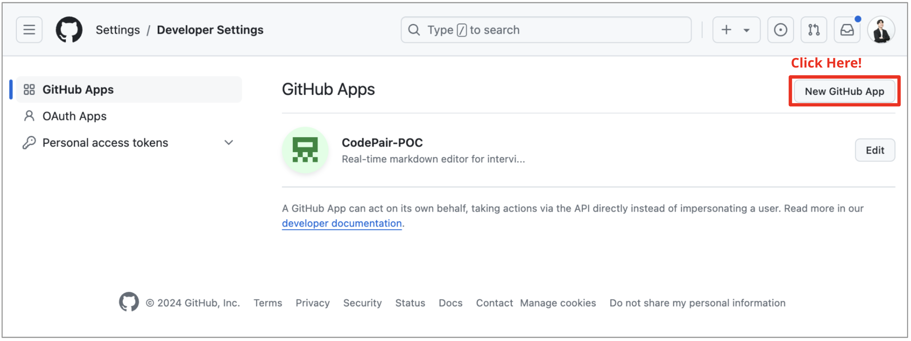
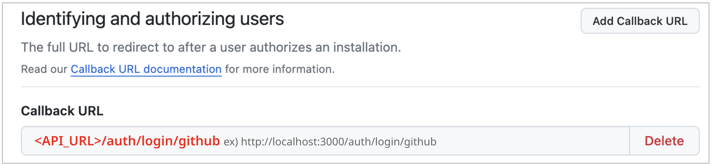
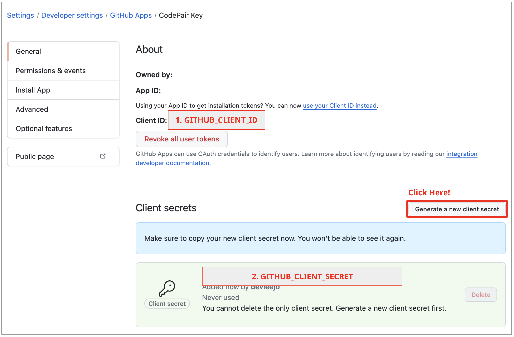

# Set Up GitHub OAuth

For the Social Login feature, you need to obtain a GitHub OAuth key before running the project. After completing this step, you should have the `GITHUB_CLIENT_ID` and `GITHUB_CLIENT_SECRET` values.

## 1. Visit GitHub and Sign In

Visit [GitHub](https://github.com/) and sign in to your account.
You should have a GitHub account to create an OAuth application.

## 2.Visit Developer Settings

You can access the Developer Setting by [this link](https://github.com/settings/apps).

Or, you can access the Developer Settings page by clicking on your profile icon in the top right corner of the page and selecting `Settings`. Then, click on the `Developer settings` tab.

## 3. Create a New GitHub App

Click on the `New GitHub App` button to create a new OAuth application.

## 4. Fill Out the Form

You should fill out the form with the following information (In Development Mode):

- Authorization callback URL: `http://localhost:3000/auth/login/github`

Other fields can be filled out according to your needs.

## 5. Get Your Client ID and Client Secret

After creating the application, you will see your `Client ID` and `Client Secret`. Copy these values and save them in a safe place. Paste the `GITHUB_CLIENT_ID` and `GITHUB_CLIENT_SECRET` values into the `backend/.env.development` or `backend/docker/docker-compose-full.yml` file.
